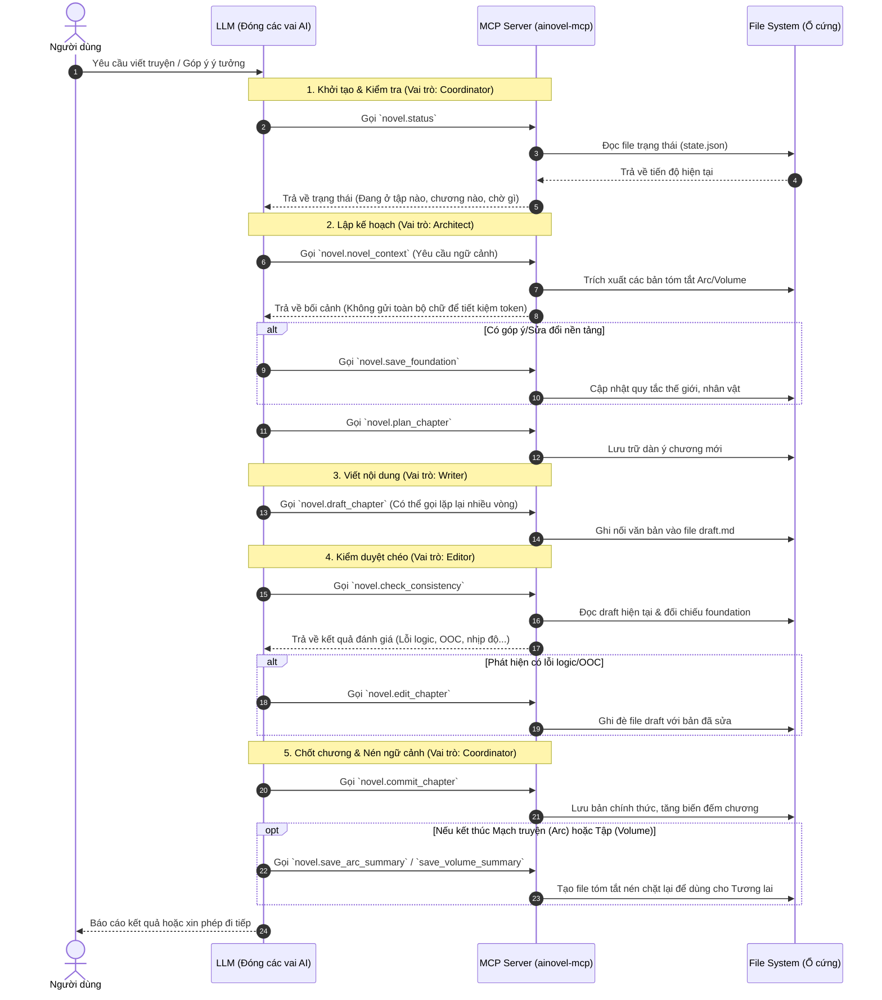

# Kiến trúc hoạt động tầng dưới của AINovel-MCP

Biểu đồ tuần tự dưới đây thể hiện cách mà hệ thống vận hành đằng sau hậu trường. Điểm mấu chốt là **MCP Server không tự có trí tuệ**, nó chỉ đóng vai trò là "cầu nối" (cung cấp các API quản lý state) và "bộ nhớ" (đọc/ghi file). Mọi logic suy nghĩ, đóng vai, tự đánh giá đều được thực thi bởi **LLM** (mô hình AI) dựa trên bộ quy tắc khắt khe của `SKILL.md`.

### Giải thích các tầng (Layers)

1. **Tầng Tương tác (User <-> LLM):** 
   - Bạn chỉ giao tiếp bằng ngôn ngữ tự nhiên.
   - LLM tự hiểu ý định của bạn và quyết định nên đóng vai trò nào (Architect để sửa bối cảnh, Writer để viết tiếp, hoặc Editor để kiểm tra).

2. **Tầng Logic & Vòng lặp (LLM <-> MCP Server):**
   - Sự kết hợp giữa bộ kỹ năng (SKILL) và các công cụ (Tool). 
   - Các tool như `check_consistency` hoạt động như những chốt chặn để bắt LLM phải dừng lại tự nhìn nhận lỗi của mình trước khi nhảy sang bước tiếp theo.

3. **Tầng Lưu trữ (MCP Server <-> File System):**
   - Đảm bảo tính "bền vững" (persistent) của dữ liệu. 
   - Ngay cả khi bạn tắt cửa sổ chat và mở lại vào hôm sau, `novel.status` và các hàm đọc/ghi sẽ móc nối chính xác vào điểm dừng cuối cùng. Đây là lõi sức mạnh giúp mô hình ngôn ngữ vốn "não cá vàng" có thể nhớ được bối cảnh của 500 chương trước đó.
